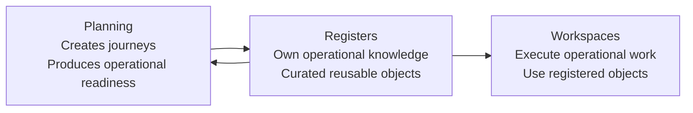
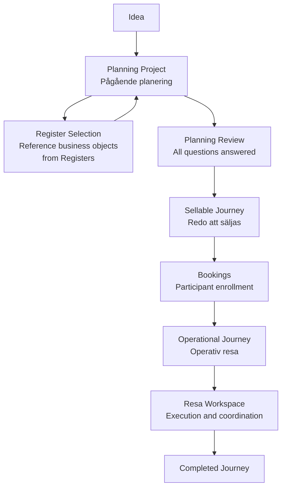
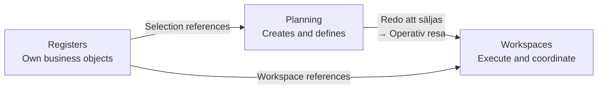

# Platform Architecture Guide

**Status:** Approved  
**Version:** 1.0

---

## Purpose

This document consolidates the platform architecture of AlpenTind Platform after completion of PDR-004, PDR-005, PDR-006, ESR-006, ESR-007, and ESR-008.

It documents what exists. It introduces no new architecture.

---

## 1. Platform Environments

AlpenTind Platform is structured around three distinct architectural environments.



---

### 1.1 Planning

**Responsibility**

Planning is the structured process of transforming a journey idea into a fully defined, operationally ready, and economically viable product.

Planning is question-driven, non-linear, and persistent across days, weeks, and months.

Planning starts as a **Planning Project** when the user selects **"Planera ny resa"** and continues through a lifecycle of operational readiness states until operational execution.

The metric for planning progress is **remaining unanswered questions**, not form completion.

**Boundary**

- Planning owns Planning Projects.
- Planning does not own business objects (contacts, accommodations, etc.).
- Planning may identify that business objects are missing, but object creation must happen explicitly in the relevant Register.
- When a journey reaches operational status (**Operativ resa**), operational responsibility moves to the Resa Workspace. The Planning Project remains available as planning history.

**Interaction with Other Environments**

- Planning **consumes** Register objects via the Selection Pattern (see §2.3).
- Planning **defines** the work that Workspaces subsequently execute.
- Planning does not directly operate Workspaces.

---

### 1.2 Registers

**Responsibility**

Registers own and maintain AlpenTind's operational knowledge as long-lived, curated, reusable business objects.

A **Register** is a curated collection of reusable business objects, manually maintained for quality and consistency, and acting as the domain's single source of truth.

Registers optimize for:

- Ownership of knowledge
- Reuse across journeys
- Discovery over execution
- Persistence over task-local data
- Clear architectural boundaries

Register objects follow a deliberate lifecycle: **Create → Maintain → Reuse → Retire**

**Boundary**

- Registers own business objects.
- Registers are not Planning environments.
- Registers are not Workspaces.
- Business objects are never created as a side-effect of planning. If a required object is missing, it must be created explicitly in the relevant Register.

Initial Register domains:

- **Contacts** (Guests, Guides, Partners, Other Contacts)
- **Accommodation** (Regions → Accommodation → Accommodation Workspace)

**Interaction with Other Environments**

- Registers **supply** objects to Planning via the Selection Pattern.
- Registers **supply** objects to Workspaces as references.
- Registers remain the authoritative source of truth. If operational knowledge changes, the change must happen in the relevant Register.

---

### 1.3 Workspaces

**Responsibility**

Workspaces execute operational work.

A Workspace is an operational environment designed to support one specific mindset. Each Workspace exists to answer one primary operational question.

Implemented Workspaces:

| Workspace | Primary Question |
|-----------|-----------------|
| Översikt | "How does the business look right now?" |
| Arbetsdag | "What should I do now?" |
| Dialog | "What do I need to understand?" |
| Resa | "Is this trip under control?" |

**Boundary**

- Workspaces execute work; they do not own knowledge.
- Workspaces reference Register objects; they are not the architectural home of that knowledge.
- Workspaces are not Registers. Discovery and execution are separated (PDR-004).
- The Workspace Design Standard (WS-002) applies only to Workspaces, not to Registers.

**Interaction with Other Environments**

- Workspaces **receive** operational requirements defined by Planning.
- Workspaces **reference** business objects owned by Registers.
- If operational knowledge changes, Workspaces surface the need but the change is made in the relevant Register.

---

## 2. Reusable Platform Patterns

### 2.1 Planning Pattern

**Purpose**

Support the structured progression of a journey idea through operational readiness states.

**Responsibility**

The Planning Pattern manages:

- Planning Project lifecycle (Pågående planering → Redo att säljas → Operativ resa)
- Planning Area presentation (question-driven, non-linear)
- Planning resume (restoring context across sessions)
- Register Selection integration within Planning Areas

**Structure**

```text
Planning Dashboard
    ↓
Planning Project (created immediately on "Planera ny resa")
    ↓
Planning Areas (question-driven, any order)
    ↓
Planning Review (final validation gate)
    ↓
Redo att säljas
```

Planning Areas are not steps. They represent operational domains (Route, Accommodation, Guide, Cost, etc.) that can be addressed in any order.

Progress is expressed as remaining unanswered questions:

- "Tour du Mont Blanc — 3 planning questions remain"
- "Haute Route — Accommodation unresolved"
- "Corporate Journey — Redo att säljas"

**Reference Implementation**

`preview/planering-projekt.html`, `preview/js/planning-area.js`, `preview/js/mock-data.js`

---

### 2.2 Register Pattern

**Purpose**

Support discovery, search, and location of business objects.

**Responsibility**

The Register Pattern manages:

- Browsing and filtering collections of business objects
- Navigating from Register to Category to List to Workspace
- Compact list display optimised for scanning at scale

**Structure**

```text
Register
    ↓
Category
    ↓
List
    ↓
Workspace
```

Platform examples:

```text
Kontakter (Register)
    → Gäster (Category)
    → Anna Andersson (List)
    → Person Workspace

Upplevelser (Register)
    → Tour du Mont Blanc (List)
    → Resa Workspace

Boenden (Register)
    → Region (Category)
    → Refuge Bonatti (List)
    → Accommodation Workspace
```

Registers should be compact, support search and filtering, and minimize visual noise. They do not contain operational workflows.

**Reference Implementation**

`preview/accommodations.html`, `preview/upplevelser.html`

---

### 2.3 Selection Pattern

**Purpose**

Allow Planning to reference business objects owned by Registers without duplicating or transferring ownership.

**Responsibility**

The Selection Pattern manages:

- Switching a Register view into selection mode (from Browse to Select)
- Carrying selected object references back to the originating Planning Area
- Preserving the return context (which Planning Project and Planning Area initiated the selection)

**Structure**

```text
Planning Area
    ↓ (needs to select a business object)
Register (enters selection mode)
    ↓ (user selects object)
Planning Area (reference stored; object remains in Register)
```

A business object referenced through Selection remains owned by the Register. It is not copied or duplicated into the Planning Project.

**Reference Implementation**

`preview/js/register-selection.js`, `preview/planering-projekt.html`, `preview/accommodations.html`

---

### 2.4 Register Workspace Pattern

**Purpose**

Provide a consistent operational environment for working on a single business object from a Register.

**Responsibility**

The Register Workspace Pattern manages:

- Presenting the full operational state of one business object (Situation)
- Surfacing work requiring attention (Work)
- Providing supporting information (Context)
- Providing contextual actions (Actions)

**Structure**

The Register Workspace follows the Workspace Pattern (WS-001):

```text
Situation
    ↓
Work
    ↓
Context
    ↓
Actions
```

New Register domains implement a configuration builder only. The `renderRegisterWorkspace(container, config)` function renders the workspace from the supplied configuration.

Configuration shape:

```text
config = {
  situation: { icon, title, badges, fields, purpose }
  work:      { heading, items: [{ id, label, priority, note }] }
  context:   { heading, sections: [{ id, heading, items, wide }] }
  actions_heading,
  actions:   [{ label, icon, href, variant }]
}
```

**Reference Implementation**

`preview/js/register-workspace.js`, `preview/accommodations-workspace.html`

---

## 3. Object Ownership Model

Object ownership is explicit and never shared.

| Object | Owner | Rule |
|--------|-------|------|
| Planning Projects | Planning | Planning Projects are created in Planning and exist only in the Planning environment. |
| Business Objects (Contacts, Accommodations, etc.) | Registers | Business Objects are created, maintained, and owned by the relevant Register. |
| Selection References | Planning (reference only) | Selection stores a reference to a business object. The object itself remains in the Register. |
| Workspace State | Workspaces | Workspaces operate on business objects but do not own them. |

**Business Objects are never duplicated.**

- Planning references business objects; it does not copy them.
- Workspaces reference business objects; they do not own them.
- If a business object must change, the change is made in the Register, not in Planning or a Workspace.

**Object creation is always explicit.**

- Business objects are never created as a side-effect of planning.
- If Planning identifies that an object is missing:
  1. Create it in the relevant Register.
  2. Curate it for quality and consistency.
  3. Resume Planning using the registered object.

---

## 4. Typical Operational Flow

### 4.1 Complete Journey Lifecycle



### 4.2 Stage Descriptions

| Stage | Environment | Purpose |
|-------|-------------|---------|
| **Idea** | — | A concept for a new journey. Journey outline produced. |
| **Planning Project** | Planning | Created immediately on "Planera ny resa". Planning begins at creation. |
| **Register Selection** | Planning → Register → Planning | Planning references business objects from Registers without duplicating them. |
| **Planning** (Pågående planering) | Planning | Active planning across Planning Areas. Uncertainty reduction through answered questions. |
| **Sellable Journey** (Redo att säljas) | Planning | All mandatory questions answered. Journey ready for sale. Product Owner decides when sales begin. |
| **Bookings** | — | Participant enrollment and booking administration. |
| **Operational Journey** (Operativ resa) | Planning → Workspace | Journey reaches economic viability. Operational responsibility moves to Resa Workspace. Planning Project remains as historical reference. |
| **Workspace** | Workspaces | Journey managed operationally. Resa Workspace coordinates participants, guides, and execution. |

### 4.3 Environment Transition Points



---

## 5. Development Rules

Every new feature must first identify its architectural home before implementation begins.

### 5.1 Identifying Architectural Home

Ask:

| Question | If yes, the home is |
|----------|---------------------|
| Does this feature transform an idea into an operational journey? | **Planning** |
| Does this feature own or maintain reusable business objects? | **Register** |
| Does this feature execute operational work on an existing object? | **Workspace** |
| Does this feature allow Planning to reference a Register object? | **Selection** |

No feature may belong to more than one architectural environment. If a feature appears to span environments, it must be decomposed.

### 5.2 Reuse Existing Platform Patterns

Before introducing any new interaction model, check whether an existing pattern applies:

| Pattern | Use when |
|---------|----------|
| Planning Pattern | Implementing any Planning Area, Planning Project state, or Planning Dashboard capability |
| Register Pattern | Implementing any new domain that requires discovery of business objects |
| Selection Pattern | Implementing any flow where Planning must reference a Register object |
| Register Workspace Pattern | Implementing any operational environment for a single Register business object |

Reuse is preferred. A new pattern may only be introduced with explicit architectural approval and documentation.

### 5.3 Avoid New Interaction Models

- Do not combine discovery and execution in a single screen (PDR-004).
- Do not create operational workflows inside Registers.
- Do not copy business objects into Planning or Workspaces.
- Do not create planning artefacts outside the Planning environment.
- Do not implement workspace behaviour outside Workspaces.

### 5.4 Implementation Process

Every new feature must follow the Engineering Constitution:

```text
Business Need
    ↓
Engineering Specification (ESR)
    ↓
Approval
    ↓
Implementation
    ↓
Engineering Review
    ↓
Architecture Review
    ↓
Merge
```

No step may be skipped. No implementation begins without an approved ESR.

---

## 6. Cross References

| Document | Location | Relationship |
|----------|----------|-------------|
| Engineering Constitution | `docs/50-engineering/ENGINEERING_CONSTITUTION.md` | Authoritative engineering governance. Defines how all implementation work is performed and reviewed. |
| Workspace Architecture (WS-001) | `docs/20-business/WORKSPACE_ARCHITECTURE.md` | Defines the Workspace Pattern (Situation → Work → Context → Actions) and all implemented Workspaces. |
| Workspace Design Standard (WS-002) | `docs/20-business/WORKSPACE_DESIGN_STANDARD.md` | Prescribes design principles for all Workspace implementations. Applies to Workspaces only, not Registers. |
| PDR-004 – Register and Workspace Separation | `docs/20-architecture/PDR-004-Register-Workspace-Separation.md` | Establishes the architectural separation between Registers (discovery) and Workspaces (execution). Defines the Register → Category → List → Workspace navigation pattern. |
| PDR-005 – Planning Architecture | `docs/20-business/PDR-005_PLANNING_ARCHITECTURE.md` | Establishes Planning as the third primary architectural environment. Defines Planning Projects, Planning Areas, planning lifecycle states, and the relationship between Planning, Registers, and Workspaces. |
| PDR-006 – Register Architecture | `docs/20-business/PDR-006_REGISTER_ARCHITECTURE.md` | Establishes Registers as the persistent knowledge environment. Defines the Register lifecycle (Create → Maintain → Reuse → Retire) and the principle that business objects are never duplicated. |
| ESR-006 – Booking | `docs/50-engineering/` | Engineering specification for UJ-005 Booking. Implements the booking stage of the operational flow. |
| ESR-007 – Planning | `docs/50-engineering/` | Engineering specification for UJ-006 Planning. Implements Planning environment capabilities. |
| ESR-008 – Resa | `docs/50-engineering/` | Engineering specification for UJ-007 Resa. Implements the Resa Workspace for operational journey execution. |

---

*This document is a consolidation of existing architecture. It introduces no new architectural concepts. All terminology, boundaries, and patterns originate from the referenced source documents.*
