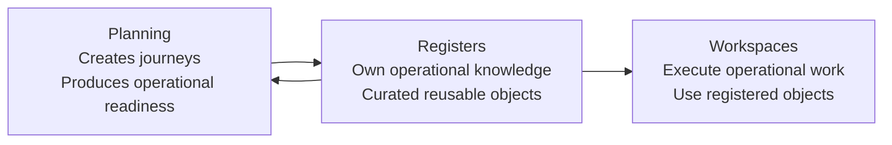
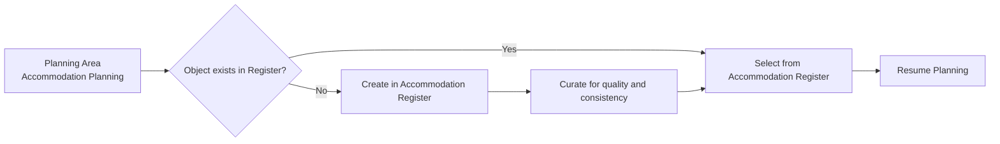
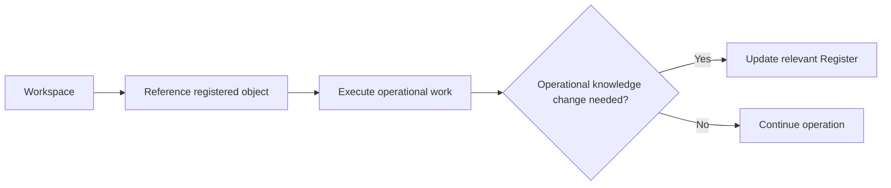

# PDR-006 – Register Architecture

**Status:** Approved

---

## 1. Executive Summary

Registers are one of AlpenTind Platform's three primary architectural environments.

They exist to own and maintain AlpenTind's operational knowledge as long-lived, curated, reusable business objects.

Registers are:

- Not temporary
- Not workspaces
- Not planning environments
- Long-lived collections of curated business objects

This decision establishes clear architectural ownership:

- **Planning creates**
- **Registers own knowledge**
- **Workspaces execute**

Every business object must have a clear architectural owner.

---

## 2. Architectural Vision

Registers own and maintain AlpenTind's operational knowledge.

Their purpose is not to store task-local data or support one-off work.

Their purpose is to preserve reusable business knowledge that improves operational quality over time.

Registers optimize for:

- Ownership of knowledge
- Reuse across journeys
- Discovery over execution
- Persistence over task-local data
- Clear architectural boundaries

---

## 3. Three Architectural Environments

AlpenTind Platform is structured around three distinct architectural environments.

### Planning

Planning creates journeys.

Planning transforms ideas into sellable journeys and produces operational readiness.

Planning is responsible for resolving uncertainty and defining what must exist for a journey to become deliverable.

### Registers

Registers own operational knowledge.

Registers contain reusable business objects and support discovery and maintenance.

Registers are the persistent knowledge environment of the platform.

### Workspaces

Workspaces execute operational work.

Workspaces use registered business objects and support daily operations.

Workspaces are not the source of truth for shared operational knowledge.

---

## 4. Register Definition

A **Register** is a curated collection of reusable business objects, manually maintained for quality and consistency, and acting as the domain's single source of truth.

Registers exist so that the business can rely on known, reusable, high-quality operational objects rather than repeatedly recreating them in local workflows.

---

## 5. Register Principles

### 1. Registers own operational knowledge

If knowledge is reusable across journeys or daily operations, it belongs in a Register.

### 2. Registers are curated

Register objects are manually maintained for quality, consistency, and trustworthiness.

### 3. Registers are reusable

Register objects should be selected and reused across multiple journeys, plans, and operational contexts.

### 4. Registers are discoverable

Register objects must be easy to find, review, and select when needed by Planning or Workspaces.

### 5. Registers are persistent

Register objects outlive individual planning sessions, work tasks, and operational events.

---

## 6. Register Lifecycle

Register objects follow a deliberate lifecycle:

**Create → Maintain → Reuse → Retire**

### Create

An object is intentionally added to the relevant Register because it is expected to be reused as operational knowledge.

### Maintain

The object is manually updated to preserve quality, consistency, and operational correctness.

### Reuse

Planning and Workspaces reference the object instead of recreating it locally.

### Retire

When an object is no longer valid, useful, or operationally relevant, it is retired from active use in the Register.

### Lifecycle Rule

Business objects are never created as a side-effect of planning.

Planning may identify that an object is missing, but object creation must happen explicitly in the relevant Register.

---

## 7. Planning Integration

Planning consumes Register objects.

Planning should choose from existing operational knowledge whenever reusable objects already exist.

### Example

**Accommodation Planning** should choose from the **Accommodation Register**.

Planning should **not** create accommodation inside Planning.

If a required object is missing:

1. Create it in the relevant Register
2. Curate it for quality and consistency
3. Resume Planning using the registered object

This keeps Planning focused on journey creation rather than knowledge ownership.

---

## 8. Workspace Integration

Workspaces reference Register objects; they do not own them.

Workspaces use operational knowledge in order to execute daily work, but they are not the architectural home of that knowledge.

If operational knowledge changes, the change must happen in the relevant Register.

Workspaces may reveal the need for updates, but Registers remain the authoritative source of truth.

---

## 9. Initial Registers

The first Register domains are:

### Contacts

- Guests
- Guides
- Partners
- Other Contacts

### Accommodation

```text
Regions
    ↓
Accommodation
    ↓
Accommodation Workspace
```

Accommodation is manually maintained in the Register and selectable from Planning.

This ensures accommodation knowledge is reusable across journeys instead of recreated per planning effort.

---

## 10. Future Registers

Future Register domains may include:

- Suppliers
- Equipment
- Vehicles
- Permits
- Locations
- Other reusable operational assets

The platform should expand Registers wherever durable operational knowledge becomes valuable across journeys or operations.

---

## 11. Register Philosophy

Registers represent accumulated operational knowledge.

The value of AlpenTind Platform increases over time as Register quality and completeness increase.

Planning benefits because journey creation becomes faster, more consistent, and less dependent on re-entering known information.

Operations benefit because Workspaces can rely on trusted, reusable knowledge that already exists.

Registers therefore turn experience into durable platform capability.

---

## 12. Register Architecture Diagrams

### 12.1 Three-Environment Model



### 12.2 Register Lifecycle


### 12.3 Planning ↔ Register Integration



### 12.4 Workspace ↔ Register Integration



---

## 13. Architecture Summary

The architectural model is explicit:

- **Planning creates**
- **Registers own knowledge**
- **Workspaces execute**

Planning creates journeys and operational readiness.

Registers own reusable operational knowledge.

Workspaces execute daily operational work using registered business objects.

Every business object must have a clear architectural owner.

That clarity is required to preserve quality, reuse, and long-term architectural coherence across the platform.
